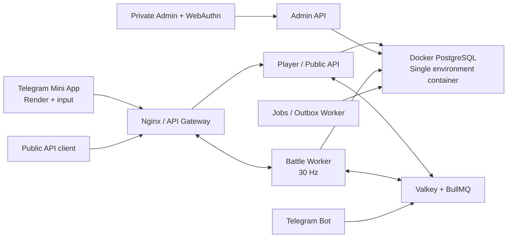

# SpaceY: production backend, Open API и server-authoritative architecture

Дата: 2026-07-11  
Статус: source of truth для backend/platform-разработки  
Связанный экранный roadmap: `SPACEY_RELEASE_SCREEN_PLAN_AND_TECHNICAL_ROADMAP_2026-07-09_RU.md`

## 1. Решение

SpaceY строится как Telegram Mini App с server-authoritative игровым контуром.

- React/Three.js-клиент через существующий `three2d` adapter отвечает за DOM UI, WebGL-отрисовку, камеру, звук, ввод, интерполяцию и косметический instant feedback.
- Сервер отвечает за правила сборки, миссии, симуляцию, AI, физику, damage, economy, inventory, progression и итог боя.
- Production-клиент не имеет offline gameplay и не может создать награду, snapshot или результат миссии.
- Первый релиз включает PvE и realtime PvP; архитектурный нагрузочный ориентир — 10k WebSocket-соединений и до 5k активных PvP-боёв.
- Первый production может работать на одном VPS, но каждый deployable-сервис имеет отдельный процесс и контракт переноса на несколько узлов.



## 2. Непереговорные границы

| Область | Клиент | Сервер |
| --- | --- | --- |
| Ввод | Преобразует устройства в `moveVector` и `actionFlags` | Проверяет sequence, rate, допустимость действия |
| Координаты и damage | Интерполирует подтверждённые snapshots | Считает fixed-step simulation |
| Сборка | Показывает editor и optimistic pending-state | Валидирует команды и создаёт immutable revision |
| Миссии | Показывает каталог, цель и прогресс | Фиксирует attempt, seed, версии и завершает результат |
| Wallet / inventory | Показывает server state | Ведёт ledger и item transition history |
| Награды | Показывает reveal | Начисляет один раз в транзакции финализации |
| Сохранение | UI-настройки и одноразовый legacy build import | Все игровые данные и прогресс |

Запрещено:

- `POST complete` с результатом, рассчитанным клиентом;
- доверие к client-provided `userId`, `profileId`, `sessionId`, reward или snapshot;
- JWT/refresh token в `localStorage`;
- импорт локального wallet, результата или прогресса;
- `Math.random`, wall clock, Three/DOM/browser API внутри server simulation package;
- optional auth на player/gameplay routes в production.

## 3. Monorepo и deployable-сервисы

Целевая структура pnpm/Turborepo:

```text
game-web                         React / Next / Three.js presentation client
apps/api                         NestJS + Fastify player/public HTTP API
apps/battle-worker               authoritative realtime battle runtime
apps/admin-web                   private admin UI
apps/admin-api                   private admin HTTP API
apps/telegram-bot                Telegram webhook and notifications
apps/jobs                        outbox, webhook, reconciliation workers
packages/contracts               shared HTTP DTO and validation contracts
packages/protocol                Protobuf + AsyncAPI realtime protocol
packages/simulation              deterministic server-only simulation
packages/db                      Prisma schema, client and migrations
```

`packages/simulation` не является зависимостью `game-web`. Клиент получает только generated
DTO/Protobuf types. Существующий Three.js/`three2d` adapter является render-only renderer и не
владеет saveable state.

## 4. Identity и Telegram auth

### 4.1. Login

`POST /api/v1/auth/telegram` принимает только raw Telegram `initData`.

Сервер обязан:

1. разобрать параметры без потери исходных значений;
2. построить Telegram data-check string;
3. проверить HMAC constant-time сравнением;
4. отклонить `auth_date` старше 300 секунд;
5. отклонить future skew более 30 секунд;
6. записать hash payload как single-use replay key;
7. создать или найти Telegram identity и игровой аккаунт;
8. выдать access token и rotating refresh cookie.

### 4.2. Session lifecycle

- Access token: JWT, TTL 10 минут, хранится только в памяти browser runtime.
- Refresh token: opaque random secret в `Secure; HttpOnly; SameSite=Strict; Path=/api/v1/auth;` host-only cookie.
- В БД хранится только hash refresh token с server-side pepper.
- Каждая ротация сохраняет token family и replacement link.
- Повторное использование старого token отзывает всю family.
- Logout отзывается текущую сессию; revoke-all отзывает все активные устройства.
- Production без корректного Telegram auth блокируется. Browser bypass допустим только при явном development flag.

Bot service отвечает за launch/referral links, уведомления, support-команды и idempotent webhook ingestion. Stars включаются отдельным feature flag только после economy audit.

## 5. HTTP API

Канонические спецификации:

- player/public HTTP: `specs/player-public.openapi.yaml` (OpenAPI 3.1.1);
- generated TypeScript SDK: `packages/public-sdk` (клиент ограничен `/public/v1`, generated output проверяется CI);
- private admin HTTP: `specs/admin-private.openapi.yaml` (отдельный приватный контракт);
- realtime: `packages/protocol/asyncapi.yaml` (AsyncAPI 3.0);
- wire format: `.proto` в `packages/protocol/proto`.

First-party `/api/v1`:

- auth, refresh, logout, revoke-all;
- bootstrap/profile;
- mission catalog и content release;
- versioned ship builds и build commands;
- inventory, wallet history, repair, craft;
- mission attempts и matchmaking tickets;
- reconnect/battle result status;
- progression, research, seasons.

Public `/public/v1` ограничен catalog, leaderboards, consented profiles, aggregate statistics и signed webhooks. Gameplay automation запрещена. Доступ — scoped API keys или OAuth2 Client Credentials, distributed quotas, key rotation и минимум 12 месяцев поддержки предыдущей major version.

Все mutation endpoints поддерживают `Idempotency-Key`, где повтор может создать финансовый или игровой эффект. Pagination — cursor-based. Ошибка имеет стабильные `code`, `message`, `correlationId` и необязательные безопасные `details`.

## 6. Realtime battle protocol

### 6.1. Session establishment

1. API создаёт `attempt` или `match` и фиксирует `contentVersion`, `simulationVersion`, build revision и seed.
2. API выдаёт подписанный одноразовый WS ticket, TTL 30 секунд.
3. API добавляет `route=<sessionId>` в WS URL; Nginx делает consistent hash по route, а worker подтверждает ownership lease в Valkey.
4. Worker атомарно consume-ит ticket и отправляет `battle.initial`.

### 6.2. Clock и сообщения

- authoritative fixed simulation: 30 Hz;
- snapshots: 10 Hz;
- рекомендуемый client interpolation buffer: около 100 мс;
- checkpoint: каждые 2 секунды;
- команды: `session.resume`, `input.command`, `ping`/`ack`;
- события: `battle.initial`, `battle.snapshot`, `battle.event`, `battle.ended`, `session.error`.

Каждый input имеет монотонный `seq`. Worker отбрасывает duplicate/old input, ограничивает rate и нормализует vectors/action flags. Snapshot содержит monotonic tick и state hash; reorder/duplicate messages не меняют результат.

### 6.3. Disconnect и recovery

- PvE пауза до 60 секунд; затем attempt завершается безопасным policy outcome.
- PvP продолжает neutral input; после grace period фиксируется forfeit.
- Valkey хранит routing, checkpoint и bounded input journal.
- Новый worker восстанавливает deterministic state из checkpoint + input log.
- Полный replay хранится 30 дней в S3-compatible storage; result и агрегаты — постоянно.

Финализация одной короткой DB-транзакцией пишет immutable result, persistent damage, inventory transitions, wallet ledger, progression и outbox event. Persistent damage v2 сопоставляет simulation module с physical inventory item UUID, проверяет итоговый module HP/detach evidence и блокирует pinned build items в стабильном UUID-порядке. Durability уменьшается только у реально повреждённых деталей с caps `PvE 2500` и `PvP 1000` basis points на item; любой ненулевой loss создаёт repairable `DAMAGED`, ноль durability — `DESTROYED`. Append-only transition хранит before/loss/after, module HP evidence и уникальный idempotency key, поэтому retry не списывает durability повторно. Launch guard разрешает только текущую build revision, отклоняет destroyed/несогласованные items и параллельный battle; `QUEUED/MATCHED` ticket резервирует revision от PvE launch/build edit, а PvP materialization получает bypass только для собственного проверенного ticket.

## 7. PostgreSQL и данные

Основные домены:

- users, Telegram identities, auth sessions и replay hashes;
- API clients, credentials, scopes, quotas и webhook subscriptions;
- versioned content releases и определения миссий/модулей/enemy/drop tables;
- ship builds, immutable revisions и installed physical items;
- attempts, matches, checkpoints, results и replay metadata;
- append-only wallet ledger и materialized balances;
- inventory items и item transition history;
- progression, research, seasons, achievements;
- Stars events, purchases и refunds;
- admin identities, WebAuthn credentials, RBAC и immutable audit;
- transactional outbox и job idempotency.

Правила:

- UUIDv7 и UTC timestamps;
- FK indexes, constraints и explicit unique idempotency keys;
- player-owned строки защищены RLS; service role не подменяет object-level authorization;
- PostgreSQL работает в одном закрытом Docker-контейнере на environment и не публикует host port;
- runtime-сервисы подключаются по внутреннему `postgres:5432`, direct credential используется только migrator/backup tooling;
- runtime, battle, bot, jobs, admin, readonly и migrator используют разные credential logins и least-privilege NOLOGIN group roles;
- production и staging имеют разные Compose projects, networks, volumes, credentials и backup prefixes;
- off-host encrypted backup и успешный restore rehearsal обязательны до production cutover;
- ledger/locks/batch hot paths используют parameterized SQL и короткие транзакции;
- migration flow — expand/contract, без destructive migration в том же deploy.

Опубликованный ранее credential считается скомпрометированным. До любого соединения его нужно ротировать. URI, пароли и токены не помещаются в Git, Docker image, CI output или документацию.

## 8. Admin-контур

- `admin-web` и `admin-api` имеют отдельный private ingress через Zero Trust/VPN.
- WebAuthn обязателен; TOTP используется только как recovery.
- Роли: SuperAdmin, ContentEditor, EconomyOperator, Moderator, Support, Analyst, Auditor.
- Каждая mutation требует reason/case context и пишет immutable before/after audit с actor и correlation ID в той же транзакции.
- Rollback создаёт новую revision.
- Economy adjustment создаёт ledger entry; прямое редактирование balance запрещено.
- Origin/CSRF, distributed rate limits и отдельная DB role обязательны.
- Private admin OpenAPI не публикуется в developer portal и не проксируется через публичный ingress.

## 9. Jobs, outbox и webhooks

Изменяющий состояние сервис пишет domain record и outbox row в одной транзакции. Jobs worker забирает outbox с `FOR UPDATE SKIP LOCKED`, доставляет event и сохраняет idempotency key. Retry использует exponential backoff и dead-letter policy.

Public webhook содержит `eventId`, timestamp, delivery attempt и payload. Подпись — HMAC по raw body и timestamp; consumer secret ротируется с overlap window. Повторная доставка является нормой.

## 10. Security и privacy baseline

- Secrets: только external env/secret store, root-owned files `0600` на VPS.
- TLS termination и security headers на gateway; internal ports не публикуются наружу.
- Distributed rate limits для auth, player API, public API и admin.
- Structured JSON logs не содержат raw `initData`, cookies, Authorization, DB URI или webhook secrets.
- IP/UA/auth logs: 30 дней; replay: 30 дней; security/admin audit: 1 год.
- Jobs применяет retention небольшими batch под transaction-scoped advisory lock: production default — 5000 строк на категорию каждые 5 минут. Истёкшие auth sessions удаляются через 30 дней после `expires_at` (self-FK rotation links обнуляются), IP/UA hash у оставшихся sessions очищается через 30 дней, `telegram_auth_replays` удаляются через 30 дней. Privacy request metadata удаляется только для `COMPLETED/FAILED` после server-owned `retention_until`; export object независимо удаляется S3 lifecycle через 7 дней. Доставленные webhook records удаляются через 30 дней, `DEAD` — через 90 дней. Из outbox удаляются только `PUBLISHED` записи старше 30 дней без незавершённой webhook-доставки; `PENDING`, `PROCESSING` и `FAILED` автоматически не удаляются. Admin audit старше одного года удаляет только jobs-only `SECURITY DEFINER` функция с фиксированным cutoff; прямой `DELETE` остаётся запрещён append-only trigger. До появления retention-lag metric дежурный alert использует backlog query из `apps/jobs/README.md`: `oldest_overdue > 30 минут` либо `rows_due >= batch size` три интервала подряд.
- Privacy preferences (`profilePublic`, analytics consent) принадлежат серверу; принятие delete request немедленно отзывает оба consent-флага и refresh sessions.
- Export/delete request идемпотентен в scope игрока, имеет durable status и создаётся вместе с transactional outbox event.
- Export формируется в canonical JSON без token hashes, пишется напрямую в private S3-compatible bucket только по HTTPS с SSE-KMS и выдаётся владельцу через короткоживущий signed URL. Без object store API/jobs закрываются fail-closed.
- Delete worker отзывает и обезличивает auth sessions, удаляет Telegram identity/support/referral data и soft-delete/anonymize профиль; append-only wallet/payment/admin/security history сохраняется по retention policy.
- `export_expires_at` ограничивает API-доступ, а физическое удаление объекта обеспечивает обязательный bucket lifecycle из `infra/s3/privacy-exports-lifecycle.json`, включая noncurrent versions/delete markers.
- CI: frozen lockfile, compatibility checks, migration test, secret scan, SBOM, tests и production builds.

## 11. Observability и SLO

- OpenTelemetry traces/metrics/log correlation во всех сервисах.
- Sentry для server/client errors с release SHA.
- Health: process alive; readiness: DB/Valkey/dependency access и migration compatibility.
- Correlation ID проходит gateway → API/worker → outbox/webhook.

Начальные SLO:

| Индикатор | Цель |
| --- | --- |
| Availability | 99.5% |
| API p95 | ≤ 250 мс |
| WS connect p95 | ≤ 2 с |
| Snapshot delivery p95 | ≤ 250 мс |
| Reward finalization p95 | ≤ 1 с |

Alerting обязателен до публичного запуска: error rate, latency, readiness, DB pool saturation, Valkey memory, battle tick lag, reconnect rate, outbox age, webhook failures и economy invariants.

## 12. Delivery и runtime topology

Каждый container image получает immutable tag `<git-sha>` и OCI revision label. Production Compose принимает только `IMAGE_TAG`, равный полному проверенному SHA. `latest` запрещён.

Rollout:

1. CI проверяет контракты, migrations, security и builds.
2. CI собирает и публикует images с exact SHA и SBOM/provenance.
3. Migrator выполняет только backward-compatible expand migration.
4. Green stack стартует рядом с blue.
5. Readiness и внутренний smoke проходят до переключения upstream.
6. Nginx атомарно переключается на green.
7. Старые API/jobs drain-ятся; battle workers перестают принимать новые сессии и ждут завершение/transfer.
8. При ошибке upstream возвращается на blue; schema rollback не требуется из-за expand/contract.

Подробный runbook: `docs/SPACEY_EXACT_SHA_BLUE_GREEN_DEPLOY_RUNBOOK_2026-07-11_RU.md`.

## 13. Этапы реализации

0. Security/platform foundation: secret rotation, monorepo, CI, Compose, contracts, baseline DB.
1. Identity/content/economy: Telegram auth, sessions, profile, builds, inventory, ledger, RLS, bootstrap.
2. Deterministic simulation: browser-free physics/AI/weapons/damage, seeded RNG, hashes.
3. Battle worker/PvE: WS/Protobuf, attempts, checkpoints, reconnect, authoritative rewards, replay.
4. Render-only client cutover: snapshot renderer, server build commands, removal of local authority.
5. Realtime PvP: matchmaking, MMR, routing, anti-cheat, disconnect/forfeit, seasons.
6. Admin/bot/Public API: private WebAuthn admin, Telegram lifecycle, developer platform/webhooks.
7. Production hardening: exact-SHA blue/green, draining, observability, load gate.
8. Monetization: Stars после economy audit, idempotent payments, reconciliation/refunds.

## 14. Проверки готовности

- Одинаковые seed/content version/build revision/inputs дают одинаковый state hash и replay.
- Forged, expired, future и replayed Telegram payload отклоняются.
- Нельзя прочитать/изменить чужой attempt, build или session.
- Retry/reconnect/job redelivery не удваивает reward.
- Retry finalization не списывает durability повторно; result и inventory transition коммитятся атомарно.
- Worker kill восстанавливает сессию в пределах 60 секунд.
- Packet loss, reorder и duplicates не ломают результат.
- Client bundle не содержит Prisma, simulation, reward tables или enemy AI.
- Admin mutation и audit commit/rollback вместе.
- Public API соблюдает scopes, quotas, idempotency и webhook signature verification.
- Load gate: 10k WS, до 5k активных PvP battles, не менее 25% CPU/RAM headroom.

## 15. Текущий статус реализации

Статус ниже нужно обновлять вместе с кодом. `Implemented` означает наличие проверенного source-level фундамента, но не production-readiness.
Подробный текущий checkpoint: `SPACEY_STAGING_VERTICAL_SLICE_IMPLEMENTATION_STATUS_2026-07-11_RU.md`.

| Контур | Статус на 2026-07-11 | Что ещё обязательно |
| --- | --- | --- |
| Monorepo и сервисные границы | Implemented foundation | Published container images и deploy proof |
| HTTP contracts | Implemented + generated TS SDK | CI compatibility history, SDK registry publication и release proof |
| DB schema/migrations/RLS | Implemented + fresh local migration/RLS proof | Rotated credentials, staging migration и backup/restore proof |
| Telegram auth/sessions | Implemented foundation | Real Telegram integration/security proof |
| Simulation/protocol/worker | Implemented source-level: v2 systems, three PvE objectives, PvP, zero-attach/recovery, per-module damage | PostgreSQL/Valkey/S3 multi-worker recovery и load proof |
| Render-only production client | Server-authoritative boundary, Three.js WebGL presentation, split lifecycle/input/buffer/renderer/HUD, dual-stick | Telegram/WS browser staging proof |
| PvP | Implemented source-level: no-show, sudden death/draw, reconnect/result recovery | Packet-chaos/load и staging proof |
| Admin | Implemented source-level: WebAuthn/RBAC/audit, logout/revoke, release clone/history/publish/rollback | Private ingress и real-FIDO staging proof |
| Bot/jobs/privacy | Implemented source-level, включая narrow Stars anonymization | Real Telegram/S3 integration и staging proof |
| Public API/developer portal | OAuth/API keys/quotas/webhooks/onboarding foundation | Generated SDK, canonical runtime OpenAPI, portal publication и staging proof |
| Production hardening | Exact-SHA/attestation workflow, isolated Compose, metrics/alerts, runbook и guarded k6 contract | Green CI/images, blue/green rehearsal и реальный 10k/5k staging gate |
| Stars | Disabled | Economy audit, reconciliation/refund tests |

Целевые typecheck/tests и статические infra/contract checks подтверждают текущую source-level интеграцию, но новые migrations/codegen и полный workspace build в этом checkpoint не выполнялись. До staging/prod proof ни один контур не считается production-ready. Admin readiness остаётся false без private ingress и реальной WebAuthn-проверки. Один VPS остаётся single point of failure; провал load gate требует multi-node deployment.
