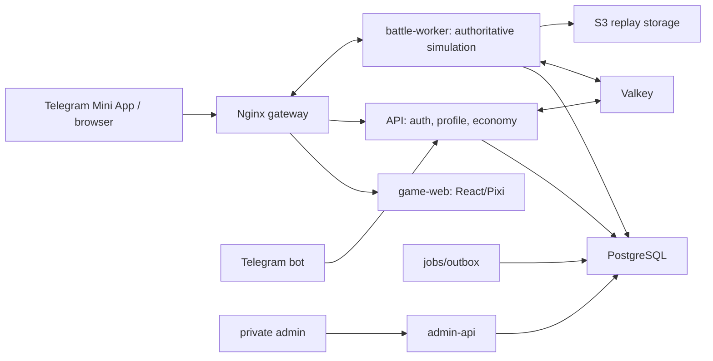
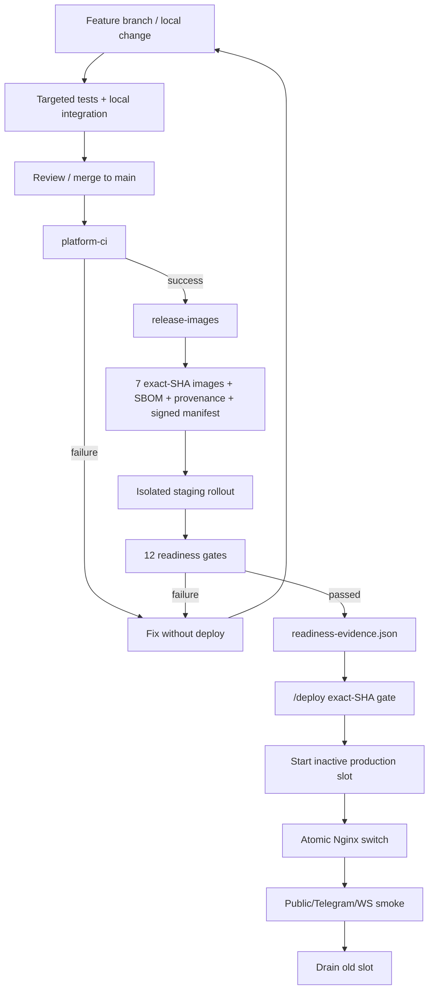
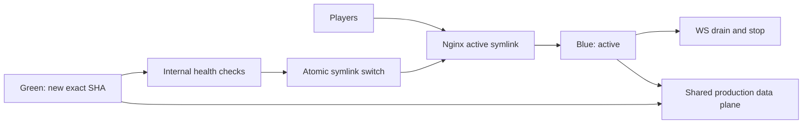

# SpaceY: серверная архитектура, окружения и сценарий разработки

Дата: 2026-07-12
Статус: source of truth для понимания dev/staging/production и пути релиза

## 1. Зачем проекту эта система

SpaceY — не обычный статический сайт. Сервер определяет результат боя, урон, награды,
инвентарь, экономику, PvP-рейтинг и состояние аккаунта. Ошибка или подмена этих данных влияет
на всех игроков и иногда необратимо изменяет экономику. Поэтому production нельзя обновлять
копированием frontend-файлов и перезапуском PM2.

Созданная схема решает пять задач:

1. клиент нельзя использовать для начисления наград или подмены боя;
2. staging проверяет тот же контейнер, который позже попадёт в production;
3. неудачный релиз можно быстро откатить без отката базы данных;
4. секреты и данные разных окружений не смешиваются;
5. для каждого production-релиза можно доказать, из какого commit и CI run он получен.

Цена этих гарантий — больше сервисов, конфигурации и обязательных проверок. Такая сложность
имеет смысл для server-authoritative multiplayer-игры, но была бы избыточной для лендинга.

## 2. Главный принцип: клиент рисует, сервер решает

Клиент отвечает за интерфейс, ввод, звук, камеру, Pixi-рендеринг и интерполяцию snapshots.
Сервер отвечает за физику, AI, попадания, damage, миссии, PvP, rewards, repair, wallet и
inventory. Клиент отправляет команды ввода, но не отправляет «готовый результат боя».

## 3. Репозиторий и сервисы

Один monorepo содержит семь запускаемых приложений:

| Сервис | Назначение | Публичность |
|---|---|---|
| `game-web` | Telegram/browser UI и render-only battle client | player ingress |
| `api` | auth, bootstrap, profile, builds, economy, attempts, Public API | через Nginx |
| `battle-worker` | PvE/PvP simulation, WS, finalization | только WS gateway |
| `admin-web` | интерфейс управления | только private ingress |
| `admin-api` | WebAuthn, content/economy operations, audit | только private ingress |
| `telegram-bot` | webhook, launch links, referrals, notifications | webhook route |
| `jobs` | outbox, privacy, retention и фоновые задачи | не публичен |

Общие packages содержат DTO, Protocol/Protobuf, DB, simulation и observability. Simulation
не должна попадать в browser bundle.

## 4. Dev, staging и production — это окружения, а не копии кода

### 4.1 Development

Development запускается на машине разработчика. Допускаются быстрый rebuild, local PostgreSQL,
Valkey и MinIO, тестовый browser auth и временные данные. Его задача — быстро написать и
отладить изменение.

- Compose: `infra/compose.local.yml`;
- данные локальные и одноразовые;
- credentials не используются в staging/production;
- результат development-теста не является разрешением production deploy.

### 4.2 Staging

Staging — изолированная репетиция production. Он запускает exact-SHA images из GHCR, а не
локально собранный код.

- player URL: `https://staging.spacey.aima.space`;
- admin URL: `https://admin-staging.spacey.aima.space` через private ingress;
- Docker projects: `spacey-staging` и `spacey-staging-data`;
- config: `/etc/spacey-staging`;
- отдельные PostgreSQL volume, Valkey ACL, Telegram bot, buckets и credentials;
- production Nginx upstream и production data не изменяются.

Staging нужен не для демонстрации макета, а для проверки миграций, Telegram → battle → result,
PvP, reconnect, backup/restore, worker drain, rollback и нагрузки.

### 4.3 Production

Production обслуживает игроков по `https://spacey.aima.space`. Здесь разрешены только images
из подписанного release manifest и только после staging readiness gate.

- config: `/etc/spacey`;
- отдельный production data plane;
- app-контейнеры работают blue/green slots;
- database/Valkey не заменяются вместе с app slot;
- admin и Public API имеют отдельные ingress-границы.

### 4.4 Git-ветки

Текущая модель — trunk-based delivery:

- рабочие изменения создаются в `codex/*` или feature branch;
- после review и тестов попадают в `main`;
- только push в `main` запускает release pipeline;
- staging и production выбирают один exact commit из `main`.

Постоянные Git-ветки `dev`, `staging`, `production` не являются источником окружений. Иначе
между ними появляется ручной merge drift: staging тестирует один код, а production получает
другой. Разница окружений хранится в runtime configuration и secrets, а не в исходниках.

## 5. Путь изменения от разработки до production

### Шаг 1. Разработка

Разработчик меняет минимальный набор файлов, выполняет targeted tests и проверяет contracts.
Изменения БД добавляются новой forward migration; опубликованные migrations не переписываются.

### Шаг 2. `platform-ci`

Workflow проверяет secrets, Compose/workflow syntax, Prisma, migrations на пустой PostgreSQL,
OpenAPI, generated SDK, AsyncAPI, Protobuf, compatibility, types, tests, build и SBOM.

### Шаг 3. `release-images`

После успешного CI GitHub параллельно собирает семь images. Каждый получает:

- tag, равный полному 40-символьному Git SHA;
- immutable registry digest;
- OCI revision label с тем же SHA;
- SPDX SBOM и BuildKit provenance attestations.

Workflow отказывается перезаписывать существующий SHA-tag. Итоговый подписанный manifest
содержит точные digest всех семи сервисов и CI run IDs.

### Шаг 4. Staging rehearsal

На staging проверяются именно digest из manifest. Создаются/проверяются data plane, service
roles, expand migrations и grants. После health checks выполняются browser E2E, PvE, ranked
PvP, reconnect, exactly-once rewards, backup/restore, failure injection и нагрузка.

### Шаг 5. Readiness evidence

`readiness-evidence.json` — не формальный чекбокс. Он привязан к SHA-256 manifest и содержит
digest доказательства каждого gate:

1. `platformCi`;
2. `releaseImages`;
3. `stagingHttps`;
4. `stagingMigrations`;
5. `pveE2e`;
6. `pvpE2e`;
7. `backupRestore`;
8. `workerDrain`;
9. `rollbackRehearsal`;
10. `faultInjection`;
11. `loadTarget`;
12. `headroom`.

Evidence действует семь дней. Placeholder или evidence от другого release блокирует deploy.

### Шаг 6. `/deploy`

`/deploy` сначала проверяет SHA в `origin/main`, зелёные workflow runs, manifest attestation,
workflow IDs, evidence и permissions. Только вывод `DEPLOY_READY` разрешает SSH и production
mutation. Legacy PM2/web-only deploy запрещён.

## 6. Blue/green production

Blue и green — две версии только application layer. PostgreSQL и Valkey находятся отдельно.

Новая версия стартует на неактивных loopback ports. После readiness Nginx symlink атомарно
переключается. Если smoke падает, symlink возвращается на старый slot. Старый battle-worker не
останавливается мгновенно: текущим WS дают завершиться или сохраниться checkpoint.

Schema rollback автоматически не выполняется. Поэтому production migration должна быть
backward-compatible expand change; destructive contract migration выполняется позже.

## 7. PostgreSQL и Valkey

Для каждого окружения data plane отделён от app slots. PostgreSQL и Valkey не публикуются в
интернет и доступны только во внутренней Docker network.

PostgreSQL использует отдельные login/group roles:

- migrator — schema ownership/migrations;
- runtime API — player operations;
- battle worker — battle/finalization;
- admin — audited admin operations;
- jobs — outbox/retention/privacy;
- bot — Telegram domain;
- readonly — диагностика;
- backup — read-only backup с ограничением соединений.

Это уменьшает ущерб при компрометации одного сервиса. RLS дополнительно ограничивает
player-owned данные. Wallet ledger, inventory transitions, audit и outbox сохраняют историю,
а не только текущее значение.

Valkey хранит rate limits, routing, tickets, queues, checkpoints и bounded input journals. Он не
заменяет PostgreSQL как постоянный источник истины.

## 8. Nginx и домены

Nginx — единственная публичная точка входа:

- `spacey.aima.space`: player UI, `/api/*`, WS и Telegram webhook;
- `staging.spacey.aima.space`: staging-аналог;
- `public.spacey.aima.space`: только `/public/v1/*`, health и OpenAPI;
- `admin*.spacey.aima.space`: private Zero Trust/VPN ingress.

API и battle-worker слушают только loopback host ports. WebSocket upgrade выполняется только на
`/realtime/v1/battle`. Admin route нельзя случайно публиковать на player/Public API host.

## 9. Secrets и внешние системы

Git содержит только examples и validators. Реальные secrets находятся в root-owned mode `0600`
файлах `/etc/spacey*`. В staging и production нельзя использовать одинаковые:

- database passwords;
- Valkey ACL;
- Telegram bot token;
- JWT/refresh/API peppers;
- S3/KMS credentials;
- WebAuthn/session secrets;
- OTel/Sentry credentials.

Telegram staging bot нужен, потому что production bot нельзя направлять на тестовый webhook.
S3/KMS нужен для replay/privacy retention и для проверки outage/retry. OTel/Sentry нужны, чтобы
health был не единственным источником информации о деградации.

## 10. Что система даёт на практике

- воспроизводимый релиз: commit → image digest → manifest → deployment;
- staging тестирует тот же бинарный артефакт, что production;
- невозможность случайно выложить dirty/local build;
- быстрый application rollback;
- отсутствие доверия к клиентским rewards/results;
- меньший blast radius благодаря service roles и private networks;
- доказуемые SBOM/provenance и audit trail;
- exactly-once economy через transactions, idempotency и outbox;
- возможность вынести API/workers на несколько узлов без переписывания контрактов.

## 11. Что система не решает автоматически

- один VPS не становится high availability;
- blue/green не откатывает destructive migration;
- manifest не доказывает качество gameplay без staging E2E;
- Docker isolation не заменяет secret rotation;
- readiness evidence нельзя создавать до реального прохождения gates;
- текущий общий Dockerfile всё ещё создаёт тяжёлые images и требует будущего per-service prune.

## 12. Текущее фактическое состояние на 2026-07-12

- `platform-ci` и `release-images` для SHA `ba874cd965758f03676941be7a552321ff0c04f8`
  успешно завершены;
- семь exact-SHA images и подписанный manifest опубликованы;
- production по-прежнему использует старый frontend deployment;
- staging data/app configuration ещё не создана;
- staging DNS указывает на VPS, но Nginx отдаёт другой AIMA frontend;
- staging TLS, отдельный bot, S3/KMS, OTel/Sentry и readiness evidence отсутствуют;
- VPS имеет недостаточный доказанный запас для gate 10k WS / 5k duels.

Поэтому `/deploy` корректно возвращает `DEPLOY_BLOCKED`. Это не поломка deploy-механизма, а
результат его работы: production нельзя переключать, пока staging не доказал готовность.

## 13. Основные source-of-truth файлы

- `docs/SPACEY_PRODUCTION_BACKEND_OPEN_API_ARCHITECTURE_2026-07-11_RU.md` — backend/Open API;
- `docs/SPACEY_EXACT_SHA_BLUE_GREEN_DEPLOY_RUNBOOK_2026-07-11_RU.md` — production rollout;
- `infra/README.md` — инфраструктурные команды и границы;
- `infra/compose.local.yml` — development stack;
- `infra/compose.production-data.yml` — environment data plane;
- `infra/compose.production.yml` — staging/blue/green app services;
- `infra/nginx/*.conf` — ingress boundaries;
- `.github/workflows/platform-ci.yml` — verification pipeline;
- `.github/workflows/release-images.yml` — signed image release;
- `infra/verify-release-manifest.sh` — supply-chain verifier;
- `infra/deploy/validate-readiness-evidence.mjs` — deploy authorization evidence validator.
